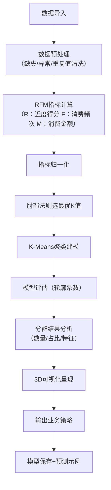

# RFM用户分层分析项目
## 项目简介
本项目基于电商用户消费数据，通过**RFM模型+K-Means聚类算法**实现用户智能分层，结合3D可视化呈现分群结果，并针对不同用户群体输出可落地的运营策略，同时完成模型工程化保存与预测示例，为电商用户精细化运营提供数据支撑。

## 核心功能
1. 数据预处理：清洗缺失值、异常值、重复值，保障数据质量；
2. RFM指标构建：计算近度（R）、频次（F）、金额（M）核心指标，转换正向指标并做描述性统计；
3. 聚类建模：通过肘部法则确定最优K值，搭建K-Means聚类模型，用轮廓系数评估模型效果；
4. 结果分析：输出各分群用户的数量、占比及核心特征，针对性制定运营策略；
5. 可视化：生成肘部法则折线图、3D分群可视化图，直观呈现分析结果；
6. 工程化：保存聚类模型与归一化器，提供新用户预测示例，支持落地部署。

## 技术栈
- 数据处理：Python、Pandas、NumPy
- 机器学习：Scikit-learn（StandardScaler、KMeans、silhouette_score）
- 可视化：Matplotlib（含3D绘图）
- 模型保存：joblib

## 快速开始
### 环境依赖
```
pandas>=2.0.0
numpy>=1.24.0
matplotlib>=3.7.0
scikit-learn>=1.2.0
joblib>=1.3.0
python>=3.8
```

### 运行步骤
1. 准备数据：将用户消费数据保存为`user_info.csv`，包含字段：`uid`（用户ID）、`last_order_date`（最后下单日期）、`order_count`（订单数）、`total_amount`（消费总额）；
2. 修改代码中数据路径：
   ```python
   df = pd.read_csv(r"你的数据路径/user_info.csv")
   ```
3. 运行主代码：
   ```bash
   python rfm_user_segmentation.py
   ```
4. 查看输出：
   - 控制台输出分群统计、业务建议；
   - 生成可视化图表（肘部法则图、3D分群图）；
   - 保存模型文件`rfm_segmentation_model.joblib`、分群结果`rfm_clustering_results.csv`。

## 核心流程


## 关键结果
### 1. 模型效果
- 最优聚类数K=3（通过肘部法则确定）；
- 轮廓系数≈0.5+（值越接近1，分群效果越好）。

### 2. 用户分群结果
| 用户群体         | 占比   | 核心特征                     | 运营策略                     |
|------------------|--------|------------------------------|------------------------------|
| 高价值活跃用户   | ~30%   | 消费频次高、金额大、近期消费 | 提供VIP服务、专属优惠        |
| 中等价值用户     | ~50%   | 消费稳定、金额中等           | 交叉销售、套餐推荐提升客单价 |
| 低价值沉默用户   | ~20%   | 长期未消费、频次/金额低      | 优惠券召回、新品通知         |

### 3. 可视化示例
- **肘部法则图**：用于确定最优聚类数，呈现簇内误差平方和随K值的变化趋势；
- **3D分群可视化图**：三维展示R（近度）、F（频次）、M（金额）分布，标记各簇中心位置。

## 输出文件
| 文件名                     | 说明                                   |
|----------------------------|----------------------------------------|
| rfm_segmentation_model.joblib | 保存的聚类模型、归一化器及元数据       |
| rfm_clustering_results.csv  | 包含用户ID、分群结果的完整数据         |

## 扩展与部署
1. 模型复用：加载保存的模型，可直接对新用户数据进行分群预测；
2. 策略落地：结合业务系统，将分群结果同步至CRM，自动触发对应运营动作；
3. 迭代优化：定期更新数据，重新训练模型，调整聚类数与运营策略。

## 备注
- 数据截止时间默认设为2019年4月1日，可根据实际数据集调整`endTime`参数；
- 若需调整分群数量，可修改代码中`k`值（建议通过肘部法则验证）；
- 可视化字体设置为宋体（SimSun），适配中文显示，可根据系统调整字体参数。
